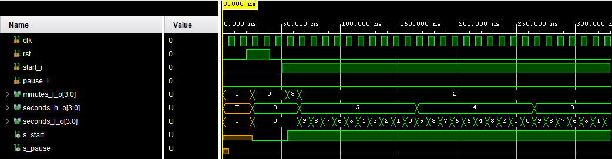
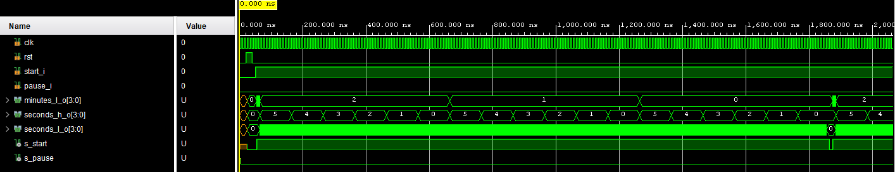
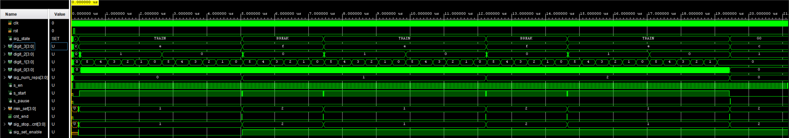

# VHDL project - Časovač na intervalový (kruhový) trénink

### Členové týmu

* Radim Pařízek 
* Martin Mička 
* Jakub Pachel 

## Teoretický popis

Cílem tohoto projektu bylo vytvořit časovač pro kruhový trénink. Tento časovač byl navržen pro vývojovou desku XILINX Nexys A7 (Artix-7 50T),
která využívá vysokokapacitní FPGA. Pro návrh tothoto časovače využijeme z hardwarových součástek 4místný sedmisegmentový displej, tlačítka a přepínače.
Tato deska bude naprogramována v programovacím jazyku VHDL.

Časovač bude umožňovat nastavení počtu kol, délky cvičícího kola a také délku pauzy mezi koly. Pro toto nastavování budem používat přepínače. Jeden z přepínačů přepne zařízení do módu nastavování. A pomocí dalších tří přepínačů si vybereme co budeme chtít nastavit. Nastavování bude pomocí levého a pravého tlačítka. Prostřední tlačítko bude sloužit k resetu. Pomocí vrchního tlačítka se bude spouštět odpočet a spodním tlačítkem se odpočet pozastaví.

## Hardware popis

Z hardwarových součástek využíváme 4 přepínače, 5 tlačítek a 4 sedmisegmentové displeje. Přepínač úplně vpravo je určen pro přepnutí do módu nastavování. První přepínač zleva je pro přepnutí do nastavování délky doby tréninku, přpínač druhý zleva je úrčen pro nastavování délky doby pauzy a třetí zleva je pro nastavení počtu kol. Nastavování tedy probíhá pomocí levého a pravého tlačítka. Problém u těchto tlačítek je, že při stisknutí tlačítka nastane takzvaný zákmit, což by znamenalo že po jednom stisknutí tlačítka by se přičetlo mnohonásobně víc sekund v nastavování. Tudíž je potřeba tyto zákmity softwarově ošetřit.

## Software popis

 * Script [stop_watch](https://github.com/grizzly42/projekt/blob/main/project/project.srcs/sources_1/new/stop_watch.vhd) slouží jako základní stopky.  Kód se skládá ze dvou částí: "entity" a "architektury":
   * V "entity" jsou definovány vstupy a výstupy stopky. Vstupy zahrnují signály pro hodinový signál, reset, startovací tlačítko, pozastavení a nastavení počátečních minut. Výstupy jsou určeny pro zobrazení sekund a minut.

   * V "architektuře" jsou definovány interní signály a logika stopek. Interní signály jsou použity pro povolení hodinového signálu, startovací tlačítko a čítače pro měření času v minutách a v sekundách.

* Script [control_state](https://github.com/grizzly42/projekt/blob/main/project/project.srcs/sources_1/new/control_state.vhd) je defakto automat pro řízení stavů.
  * V části "entity ctrl_state" jsou definovány vstupní a výstupní porty entity, včetně signálů pro hodnoty týkající se stavů a zobrazení času.

  * V části "architecture behavioral" je definován datový typ "t_state" pro reprezentaci stavů automatu. Jsou také definovány různé signály pro uchovávání stavu, hodnoty času a nastavení.

  * Následuje instance dvou komponent: "clock_enable" a "stopwatch". Komponenta "clock_enable" generuje pulsy s frekvencí 1 Hz pro řízení synchronních procesů. Komponenta "stopwatch" řídí odpočítávání času a generování signálů pro zobrazení na sedmisegmentových displejích.

  * Poté následuje část "p_ctrl", která reprezentuje řídící proces. V tomto procesu se na základě hodnot vstupních portů a stavu automatu vykonávají příslušné akce a přechody mezi stavy.

  * Další část "p_output_fsm" reprezentuje proces pro zobrazení hodnoty času na sedmisegmentových displejích v závislosti na aktuálním stavu automatu.

* Kód [s_debouncing](https://github.com/grizzly42/projekt/blob/main/project/project.srcs/sources_1/new/s_debouncing.vhd) představuje implementaci modulu pro potlačení zákmitů u signálu tlačítka. Modul generuje výstupní signál, který indikuje, zda je tlačítko stisknuto pro potlačení zákmitů.

  * Kód začíná importem potřebných knihoven. Poté je definována struktura modulu s vstupními a výstupními signály. Vnitřně se vytváří signál pro povolení potlačení zákmitů.

  * Následuje instance jiného modulu, který generuje pulzy povolení na základě hodinového signálu a resetovacího signálu.

  * V samotném procesu se kontroluje hodinový signál a resetovací signál. Pokud je resetovací signál nastaven na logickou hodnotu '1', výstupní signál je nastaven na logickou hodnotu '0'. V opačném případě se kontroluje, zda je tlačítko stisknuto a zda je povoleno potlačení zákmitů. Pokud ano, výstupní signál je nastaven na logickou hodnotu '1', jinak na logickou hodnotu '0'.

  * Tímto způsobem je zajištěno potlačení zákmitů u signálu tlačítka.
 
 * Kód  [top](https://github.com/grizzly42/projekt/blob/main/project/project.srcs/sources_1/new/top.vhd) je jako návod pro zapojení a řízení displeje, který ukazuje čas. Kód obsahuje definice vstupů (např. tlačítka) a výstupů (např. segmenty displeje), a také popisuje jak tyto části spolu komunikují. Tímto způsobem můžeme vidět aktuální čas na displeji a ovládat ho pomocí tlačítek.

* Zbylé použité scripty jsou použity ze zdrojových kódů z počítačových cvičení na kterých jsme pracovali v průběhu semsetru a byli jen trochu poupraveny.

### Simulace komponentů

Na obrazcích vidíme simulaci komponentu [stop_watch](https://github.com/grizzly42/projekt/blob/main/project/project.srcs/sources_1/new/stop_watch.vhd), při nastavení délky kola, script správně odečítá čas a spravně se mění, když například dojde na 2:00, tak po odečtení jedné sekudny přejde na 1:59.

Na obrázku můžeme vídět simulaci scriptu [control_state](https://github.com/grizzly42/projekt/blob/main/project/project.srcs/sources_1/new/control_state.vhd), podle simulace script funguje tak jak má. Správě se mění stavy a také mají dobře nastavenou délku. Čas se odečíta podle předpokladu a při změně stavu se sám přepne na správné nastavení, které se zadalo na začátku tréninku. 

## Návod k použití

* Nastavení parametrů pro časovač na kruhový trenink.

  * Nejdříve je potřeba přepnout přepínač do módu nastavování. Tím že přepínač úplně v pravo (viz obrázek `SET` ) posuneme směrem k tlačítkům.
  Když jsme v módu nastavování můžeme pomocí nasledujících odrážek nastavit co budeme nastavovat:
    * Pro nastavování délky doby tréninku posuneme tlačítko které je nejvíce v pravo (viz obrázek `TRAIN` ) směrem k displeji.
    * Pro nastavování délky doby pauzy mezi tréninkem posuneme tlačítko které je druhé z leva (viz obrázek `BREAK` ) směrem k displeji.
    * Pro nastavování počtu kol tréninků  posuneme tlačítko které je třetí z leva (viz obrázek `REPS` ) směrem k displeji.
  * Když máte vybráno co chcete nastavovat (počet opakování / délku pauzy / délku kola tréninku ). Tak můžete tyto hodnoty měnit pomocí levého a pravého tlačítka.
    * Po stisknutí levého tlačítka (viz obrázek `DOWN` ) se hodnota o jednu jednotku zmenší.   
    * A po stisknutí pravého tlačítka (viz obrázek `UP` ) se hodnota zvětší o jednu jednotku.
* Pro přepnutí do modu kde bude běžet časovač posuňte přepínač úplně v pravo (viz obrázek `SET`) směrem od tlačítek.
  * Pro supštění časovače zmáčkněte tlačítko start které je úmístěno mezi tlačítky nahoře A(viz obrázek `START` ).
  * Pro zastavení časovače zmáčkněte tlačítko stop které je úmístěno mezi tlačítky dole (viz obrázek `STOP`)
  * Jestli chcete jet celý trénink od znova stiskněte tlačítko reset které je umístěno mezi tlačítky přesně uprostřed (viz obrázek `RESET`).
  
  .

* Veškeré data se zobrazují na levém 4 místném sedmisegmentovém displeji. A to jak v módu nastavování tak v módu zobrazování časovače.
  * Vlevo se zobrazuje stav (viz obrázek `STATE` ) 
  * NA druhém sedmisegmentovém displeji zleva se zobrazují minuty (viz obrázek `MINUTES` ) 
  * NA dvouch sedmisegmentových displejích zprava se zobrazují sekundy (viz obrázek `SECONDS` ) 

## References

1. [Nexys A7 Reference Manual](https://digilent.com/reference/programmable-logic/nexys-a7/reference-manual)
2. [One-minute stopwatch](https://www.edaplayground.com/x/2uKg)
